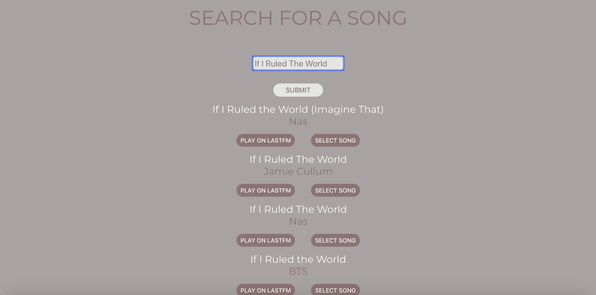

# V/SUAL MP5 | VISUAL MP5

V/SUALMP5 is an application for users to create 'mashups' of visuals and audio that go together well.

Users can create there own mashups of Songs and GIFS and post for others to see as well.

**DEPLOYED LINK**

[https://visual-mp5.herokuapp.com/](https://visual-mp5.herokuapp.com/)

**TECHNOLOGIES USED**  
- HTML5 
- CSS
- JAVASCRIPT
- EXPRESS
- EXPRESS-SESSION
- MONGO
- MONGOOSE
- REACT
- REACT-ROUTER
- AXIOS
- DOTENV
- BCRYPT
- CORS

**API's USED**
- LASTFM API
- GIPHY API

**DEPLOYMENT**
- HEROKU
- MLAB

**SCREENSHOTS**

**EARLY PLANNING**

**FUTURE PLANS / UPCOMING FEATURES**
- UpVote and DownVote System
- Youtube Search API implimentation
- Spotify / Soundcloud Support
- In-Home Widget for playing music
- Art API search implimentation
- Created User is shown with every post
- Search Algorithm for having related visuals in all mediums appear after searching a song
